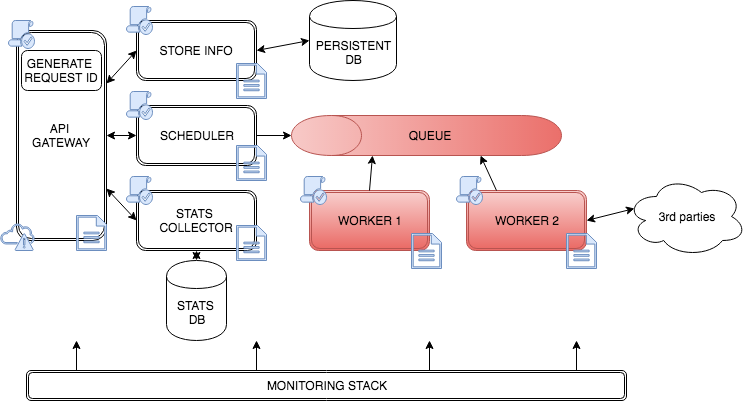
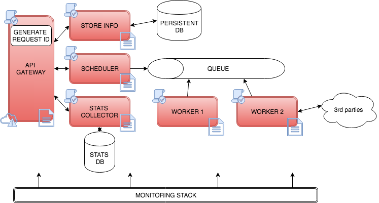

# Python es útil en microservicios

@VITIMan

Meetup Python-Madrid - 6 Septiembre 2017

## Hola, soy Viti

 

Trabajo en @QindelGroup

@VITIMan por internet

## Un ejemplo

## Temas a tratar

- API Gateway
- Generación de identificadores
- Logging
- Configuraciones
- Comunicación por mensajes
- Tolerancia a fallos
- Monitorización y Debugging

## API Gateway

##### API Gateway

- El punto de entrada
- El que sirve al resto de servicios
- El que prepara las peticiones con los demás
- El que normaliza las respuestas
- El que autoriza las transacciones

##### API Gateway

- `DjangoRESTFramework...` 
- Bottle o un Flask también vale (`sanic`, `apistar`)
- O incluso, `gunicorn` o `werkzeug` directamente
- Serializar
- Validar esquemas. `json-schema`
- Autorización: JSON Web Token (pyjwt) o HTTP Auth Basic...

##### API Gateway (I)

    # Our configuration file
    {
        ...
        "router": {
            "HTTP_GET:/object/": "app.get_something",
            "HTTP_POST:/object/": "app.create_something
        },
        ...
    }

##### API Gateway (II)

    import importlib

    def app(environ, start_response):
        path = environ['PATH_INFO']
        method = environ['REQUEST_METHOD']

        m = config["router"].get("{}:{}".format(method, path)
        module = importlib.import_module(m)
        request_id = get_request_id()

        with logging.ndc(request_id):
            res = getattr(module, "execute_view")(
                *args, **kwargs)
        return res

## Generación de identificadores

##### Generación de identificadores

- Uno de los servicios genera identificador principal
    - API Gateway
- Entre servicios relacionados
    - Identificador secundario
- Si las transacciones se subdividen
    - Indentificador secundario

##### Generación de identificadores

    import uuid
    str(uuid.uuid4())

    ----
    import string
    import random

    def random_string(
            N, chars=string.ascii_letters + string.digits):
        return ''.join(
            random.choice(chars) for _ in range(N))

    >> random_string(8)
    'ABC134JK'

## Logging

##### Logging

- Formato de log adecuado, uniforme y sencillo
- `IDLEVEL1:IDLEVEL2|SERVICE1|GET|`
     `/somepath/|foo=bar|key=value`
- Nested Diagnostic Context 
- Podemos extender la librería logging de Python
- Líneas de log puedan ser trazadas y "parseadas"

##### Logging (I)

    with log.ndc("IDLEVEL1"):
        log.info("SOME FIRST LEVEL LOG")
        """ ID1|SOME FIRST LEVEL LOG """

        with log.ndc("NESTEDID"):
            log.info("SOME SECOND LEVEL LOG")
            """ ID1:NESTEDID|SOME FIRST LEVEL LOG """

### Logging (II)

    import logging 

    class NDCLogger(logging.Logger):
        ndc = []

        def handle(self, record):
            record.ndc = ":".join(map([_ for _ in self.ndc]))
            return super(NDCLogger, self).handle(record)

        def ndc_push(self, text):
            self.ndc.append(text)

        def ndc_pop(self):
            self.ndc.pop()

### Logging (y III)

    class NDCLogger(logging.Logger):
        # ...

        @contextmanager
        def ndc(text):
            ndc_push(text)
            try:
                yield
            finally:
                ret = ndc_pop()
                if ret != text:
                    log.warn("", ret, text)

    logging.setLoggerClass(NDCLogger)
    log = logging.getLogger(__name__)

## Configuraciones

### Configuraciones

- Variables de entorno
- Declararlas desde `docker`, `initd` o `systemd`
- Declaramos nombres de nuestros procesos `argparse` o por `sys.argv`
- El nombrado de los procesos es importante: `setproctitle`
- Conocer la versión de configuración que estás utilizando
- Actualizar en caliente la configuración: `signal`

### Variables de entorno (I)

`>> python /path/to/cool_app.py -a COOL_APP`

    import argparse

    parser.add_argument('-a', action="store", 
        dest="app_name", help="HELP")

    arguments = parser.parse_args()
    APP_NAME = arguments.app_name
    # Let's get the environment variables

### Variables de entorno (II)

`>> python /path/to/cool_app.py`

    import os.path
    import sys

    if 'prefix_' in os.path.basename(sys.argv[0]):
        # /path/to/cool_app.py
        APP_NAME = os.path.basename(
            sys.argv[0]).split(".")[0].upper()
        # APP_NAME is "COOL_APP"
        # Let's get the environment variables

### Variables de entorno (y III)

    >> export COOL_APP_LOG=/path/logfile
    >> export COOL_APP_CONFIG=/path/logfile
    ---
    import os
    import logging.config as loggingconfig

    APP_NAME = "COOL_APP"  # From previous slides
    loggingconfig.fileConfig(
        os.environ.get("{}_LOG".format(APP_NAME)))
    load_config(os.environ.get("{}_CONFIG".format(APP_NAME))

### Versionado (I)

    import json, setproctitle, json, md5, re
    from setproctitle import setproctitle, getproctitle

    conf = None
    
    def load_config(json_raw):
        md5sum = md5.new(json_raw).hexdigest()
        conf = json.loads(json_raw)
        conf['md5sum'] = md5sum
        
        current_psname = getproctitle()
        if "MD5:" in current_psname:
            setproctitle(re.sub("MD5:\[.*?\]", "MD5:[{}]".format(
                md5sum), current_psname))
        else:
            setproctitle(current_psname + " MD5:[{}]".format(md5sum)))

### Versionado (y II)

    >> ps -ef

    viti    80434  95856  0 jul19 ?        02:25:02 
    gunicorn: worker [gunicorn_viti-app] 
        MD5:[e206c2602f99c2eaf8daa85848cd92ad]

## Comunicación por mensajes

### Comunicación por mensajes

- `AMQP`, `celery`...
- Una base de datos puede ser un paso de mensajes
    - `SELECT FOR UPDATE` ó `findAndModify`
- También puedes crear tu propio worker
- Crear tu loop, o event loop, para consumir trabajos

## Tolerancia a fallos

### Tolerancia a fallos

- Evitar fallos en cadena
- Circuit Breaker
- Capturar todos los errores de conexión necesarios
- Y devolver a los demás una respuesta adecuada
- Anotación con decoradores 
    - O usar alguna implementación existente: `pyfailsafe`, `circuitbreaker`

##### Tolerancia a fallos (I)

    @circuit_breaker(
        timeout=10, retries=3, 
        allowed_excepions=[], failure_exceptions=[])
    def some_method(req):
        res = get_from_some_place(req)
        return res

##### Tolerancia a fallos (II)

    def circuit_breaker(timeout=10, retries=3, 
                        allowed_exceptions=[], 
                        failure_exceptions=[])
        def decorated_function(f):
            @wraps(f)
            def deco(*args, **kwargs):
                num_retries = 0
                with Timeout(_timeout, False):
                    while num_retries < retries:
                        try:
                            res = func(*args, **kwargs)
                        except allowed_exceptions:
                            return "controlated response"
                        except failure_exceptions:
                            num_retries += 1
                        else:
                            return res

                return "broken_circuit_response"
            return deco
        return decorated_function

## Arranque y parada

##### Arranque y parada

- Tus procesos se mueren
- Tareas de limpieza y recuperación
    - Deben ser rápidas
- Duplicidades al crear procesos
- Cuidado con la versión de las configuraciones

##### Arranque y parada (I)

    import signal

    class Worker():

        def init_signals(self):
            """ Initialize all master signals """
            signal.signal(signal.SIGHUP, self.capture_signal)

        def capture_signal(self, sig, frame):
            """ send reload to all what you need """
            self.reload = True  # Reload state for main loop

##### Arranque y parada (y II)

    class Worker():
        ...
        def run(self):
            while not self.interrupted:
                init_and_cleanup()
                while not self.reload:
                    # findAndModify - SELECT FOR UPDATE
                    job = get_job()
                    ...
                graceful_reload()
                self.reload = False

## Monitorización y Debugging

##### Monitorización y Debugging

- Monitorización, imprescindible 
- Múltiples fuentes de información
- Trazabilidad de una transacción
- Da una visibilidad de tu plataforma
- `ELK`, `TICK`

## Concluyendo

- Tienes las herramientas para hacer microservicios
- Identificar bien todas las partes antes de hacer nada
- Buen nombrado y un buen logging

## ありがとうございました
